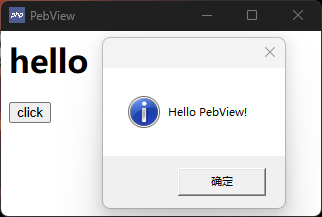

# PebView

> A cross-platform webview component that displays HTML content in native GUI windows. It lets you use web technologies in desktop applications while hiding the fact that the GUI relies on a browser. / 一个跨平台 webview 组件，允许在原生 GUI 窗口中展示 HTML 内容，让您在桌面应用中使用 WEB 技术，同时隐藏 GUI 依赖浏览器的事实。

[中文文档](./doc/Chinese/Introduction.md)
[English document](./doc/English/Introduction.md)

## 要求

- PHP 8.2 或更高版本
- PHP-FFI 扩展
- Composer
- Windows x86_64 
- Linux x86_64 或 aarch64
- MacOS x86_64 或 arm64

## 安装

```bash
composer require kingbes/pebview
```

### 示例

```PHP
// 根据你的实际情况，修改下面的路径
require "/vendor/autoload.php";

use Kingbes\PebView\Window; // 引入 Window 类

// 创建一个窗口
$win = new Window();
$win->setTitle("PebView") // 设置窗口标题
    ->setHtml( // 设置窗口的 HTML 内容
        <<<HTML
    <h1>hello PebView!</h1>
HTML)
    // 运行窗口
    ->run()
    // 销毁窗口
    ->destroy();
```



### 编译

每个平台只产出一个动态库：`lib/<系统>/<架构>/PebView.{dll,so,dylib}`（窗口、对话框、系统通知都在其中）。

| 平台 | 命令 | 依赖 |
| --- | --- | --- |
| Windows | `source\build.cmd` | Visual Studio 2022（C++ 工具集）+ Windows SDK |
| Linux | `./source/linux.sh` | gcc / g++ / pkg-config / gtk+-3.0 / webkit2gtk-4.1 / libnotify |
| macOS | `./source/macos.sh` | Xcode Command Line Tools（默认同时产出 x86_64 与 arm64）|